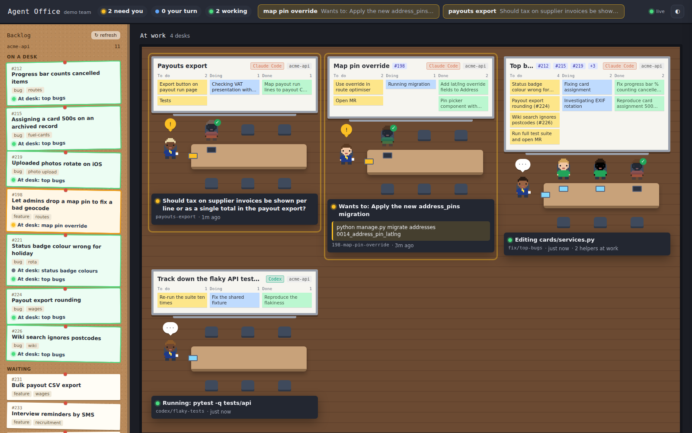

# Agent Office

Your AI coding sessions as a room full of desks. One desk per session: the agent running it sits at
the head of the table, the helpers it spawned sit around it, the whiteboard above shows that
session's own task list, and the wall on the left is your issue backlog.

It answers the question a row of terminal tabs doesn't: **which of these is stuck waiting for me,
and what does it want?**



```bash
git clone https://github.com/frankjrobinson/agent-office
cd agent-office
node server.js          # then open http://localhost:3200
node server.js --demo   # a pretend team, if you want a look first
```

Node 20 or newer. No dependencies. Binds to 127.0.0.1 only.

## What's on screen

**At work** holds every live desk, whatever agent or machine it came from, with anything waiting on
you first. Each desk carries two tags: which agent is running it, and where it's working.

- **The head of the table** is the session's main agent. Its bubble shows `···` while working, an
  amber `!` when it needs you, `?` when it's your turn.
- **The seats around it** are subagents, each with its own brief. A green tick means it reported
  back. Hover for what it's doing.
- **The whiteboard** is the session's own task list, in To do / Doing / Done.
- **The status line** says what's happening in plain English — "Running the tests", not
  `Bash(pytest -q)` — and, when a session is blocked, the actual question or the exact command it
  wants to run.

**Dormant** below holds sessions idle for half an hour or finished, one compact line each.

**The top bar** lists every session waiting on you, with its question, so you can clear them without
hunting through terminals. Click any desk for the full picture: the brief, the board, the team, the
tickets, and a command to pick the session back up.

## Which agents get a desk

| Agent | How it's read | Live status |
| --- | --- | --- |
| Claude Code | transcripts in `~/.claude/projects` | yes, with hooks |
| Cowork (desktop) | the Claude app's local session folders (macOS) | via transcripts |
| Codex CLI | rollout files in `~/.codex/sessions` | via transcripts |
| Anything else | a beacon file it writes itself | as often as it writes |

There are two ways to add an agent: a reader (a parser plus a discovery function — `CONTRIBUTING.md`
walks through it), or a beacon, which needs no code at all. Cloud and browser-based agents that
write nothing locally can only use beacons.

## Live status

With hooks installed, Claude Code tells the office the moment a tool starts, a permission prompt
appears, or a turn ends:

```bash
npx agent-office --install-hooks    # backs up ~/.claude/settings.json first
npx agent-office --uninstall-hooks  # removes only its own entries
```

Without them everything still works by reading transcripts; it's just a few seconds behind and
permission prompts are less reliable. If you also run
[Pixel Agents](https://github.com/pablodelucca/pixel-agents), Agent Office registers alongside it
and accepts its hook events too, so one hook install feeds both.

## The backlog wall

Open issues are read with the tracker's own CLI, inside each repo a desk is working in: `gh issue
list` for a GitHub remote, `glab issue list` for a GitLab one. The remote in `.git/config` decides
which; `--forge github|gitlab|none` overrides it. Whichever you use has to be signed in already.

An issue moves to "On a desk" when a session is working on it — matched from the branch or worktree
name (`212-fix-progress`), or a mention of `#212`, `ABC-212` or an issue URL in the session's first
message, latest message or task cards.

## Beacons: sessions that aren't on this machine

An agent with no local transcript reports in instead: it writes `beacons/<id>.json` and refreshes it
as it works. A beacon not refreshed for six minutes shows as "No recent report".

```json
{
  "id": "session_01ABC",
  "agent": "Claude (cloud)",
  "surface": "cloud",
  "title": "Three or four words",
  "status": "working",
  "activity": "What it's doing right now",
  "goal": "What it was asked to do",
  "lastAssistant": "The last thing it said",
  "waiting": { "kind": "question", "text": "What it needs from you" },
  "tasks": [{ "subject": "A card", "status": "in_progress" }],
  "agents": [{ "type": "explorer", "description": "What it went to find", "status": "running" }],
  "link": "https://...",
  "startedAt": 1790090000000,
  "updatedAt": 1790099000000
}
```

Only `id`, `status` and `updatedAt` are required. `status` is `working`, `needs_you`, `your_turn` or
`ended`. Delete the file, or set `ended`, when the session is done.

## Options

| Option | Default | What it does |
| --- | --- | --- |
| `--port 3200` | 3200 | Port to serve on. |
| `--hours 8` | 8 | How far back to look for sessions. |
| `--repo ~/path` | none | Always show this repo's backlog, repeatable. |
| `--forge auto` | auto | `auto`, `github`, `gitlab` or `none`. |
| `--transcripts ~/dir` | none | Another folder of transcripts to read. |
| `--codex ~/dir` | `~/.codex/sessions` | Where Codex keeps its rollouts. |
| `--beacons ~/dir` | `beacons/` | Where beacon files live. |
| `--demo` | off | A pretend team, for a look around. |
| `--install-hooks` / `--uninstall-hooks` | — | Manage the Claude Code hook. |

`http://localhost:3200/api/debug` lists the folders and sessions it found — useful when a desk you
expect isn't there.

## Privacy

It reads your session transcripts, so the screen shows parts of your conversations: prompts,
replies, and the commands agents want to run. Everything stays in memory and on 127.0.0.1, and
nothing is sent anywhere. Don't expose the port, and don't run it on a shared machine. `beacons/` is
git-ignored because those files carry conversation snippets too.

## Contributing

Another agent is the contribution worth having — see `CONTRIBUTING.md`. No dependencies, and never
interfere with the session being watched.

## Licence

MIT.
